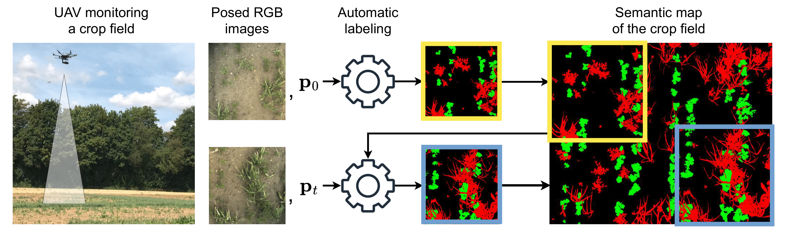

<div align="center">
    <h1>Unsupervised Semantic Label Generation in Agricultural Fields</h1>
    <p><em>An Adapted Framework for the WeedMap Dataset</em></p>
    <br />
    
    <br/>
    <a href=https://www.ipb.uni-bonn.de/wp-content/papercite-data/pdf/roggiolani2025frai.pdf>Original Paper</a>
    <span>  •  </span>
    <a href=https://github.com/PRBonn/unsemlabag/issues>Contact Us</a>
    <br />
    <br />
</div>

This repository contains the code for "Unsupervised Semantic Label Generation in Agricultural Fields" \[[1](#citation)\], specifically adapted to run experiments on the **WeedMap** dataset \[[2](#citation)\].

The framework simulates a drone's flight over a field orthomosaic, using computer vision heuristics to generate pseudo-labels, which are then used to train an evidential deep learning network for semantic segmentation.

---

## 1. Setup

### Environment

We recommend using Docker for a reproducible environment. You may need to [install the NVIDIA container toolkit](https://docs.nvidia.com/datacenter/cloud-native/container-toolkit/latest/install-guide.html) to enable GPU access.

Build the Docker image:
```bash
make build
```

### Download the WeedMap Dataset

This project uses the RedEdge subset of the WeedMap dataset.

```bash
# This command will download and unzip the RedEdge data into a `dataset/` directory.
make download_weedmap
```

---

## 2. Full 5-Fold Cross-Validation Workflow

The entire experimental pipeline, from generating pseudo-labels to training all five models for cross-validation, has been automated.

### Step 2.1: Generate Pseudo-Ground Truth for All Folds

This step runs the UnsemLabAG labeling pipeline on each of the five WeedMap orthomosaics. It uses the corresponding configuration file (`config/config000.yaml`, etc.) for each field to handle its unique dimensions and parameters.

**Note:** This is a computationally intensive process.

```bash
# This single command will generate the pseudo-label maps for all 5 fields.
make generate_all_folds
```
The generated maps will be saved in the `results/` directory (e.g., `results/field_000_generated_label.png`).

### Step 2.2: Extract Patches from All Maps

This command slices the original images and the newly generated pseudo-label maps into smaller patches (e.g., 512x512) suitable for training a neural network.

```bash
# This command extracts patches for all five fields.
make map_to_images_all_folds
```
The patches will be saved in `results/generated_patches/`.

### Step 2.3: Train All Models for 5-Fold Cross-Validation

This is the final step. It will launch five separate training runs. In each run, one field is used for testing, while the other four are used for training, following the 5-fold cross-validation scheme defined in the config files.

```bash
# This will train 5 separate models and save the best checkpoint for each.
make train_all_folds
```
The trained model checkpoints for each fold will be saved in their respective `experiments/` directory.

---

## How to Customize and Run Manually

If you want to run the process for a single field or with a custom configuration, you can use the individual `make` targets.

### 1. Generate Labels for a Single Field

To generate the pseudo-GT for just one field (e.g., field `000`), specify the config file:
```bash
make generate CONFIG="config/config000.yaml"
```

### 2. Extract Patches for a Single Field

After generating the map, extract the patches:
```bash
make map_to_images CONFIG="config/config000.yaml"
```

### 3. Train a Single Model

To train the model for a single fold (e.g., the one where field `000` is the test set):
```bash
make train CONFIG="config/config000.yaml"
```

### 4. Test a Specific Model

To evaluate a saved model checkpoint on its corresponding test set:
```bash
make test CHECKPOINT="./experiments/path/to/best_model.ckpt" CONFIG="config/config000.yaml"
```

---
## Citations

[1] **Unsupervised Semantic Label Generation in Agricultural Fields**
```bibtex
@article{roggiolani2025unsupervised,
  title={Unsupervised Semantic Label Generation in Agricultural Fields},
  author={Roggiolani, Gianmarco and R{\"u}ckin, Julius and Popovi{\'c}, Marija and Behley, Jens and Stachniss, Cyrill},
  journal={Frontiers in Robotics and AI},
  year={2025}
}
```

[2] **WeedMap: A Large-Scale Semantic Weed Mapping Framework...**
```bibtex
@article{sa2018weedmap,
  title={Weedmap: A large-scale semantic weed mapping framework using aerial multispectral imaging and deep neural network for precision farming},
  author={Sa, Inkyu and Popovi{\'c}, Marija and Khanna, Raghav and Chen, Zetao and Lottes, Philipp and Liebisch, Frank and Nieto, Juan and Stachniss, Cyrill and Walter, Achim and Siegwart, Roland},
  journal={Remote sensing},
  volume={10},
  number={9},
  pages={1423},
  year={2018},
  publisher={MDPI}
}
```